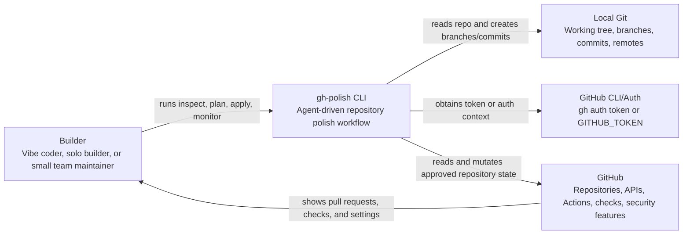
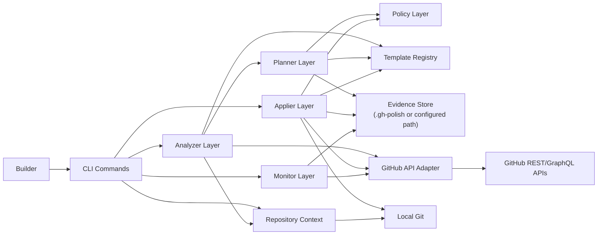
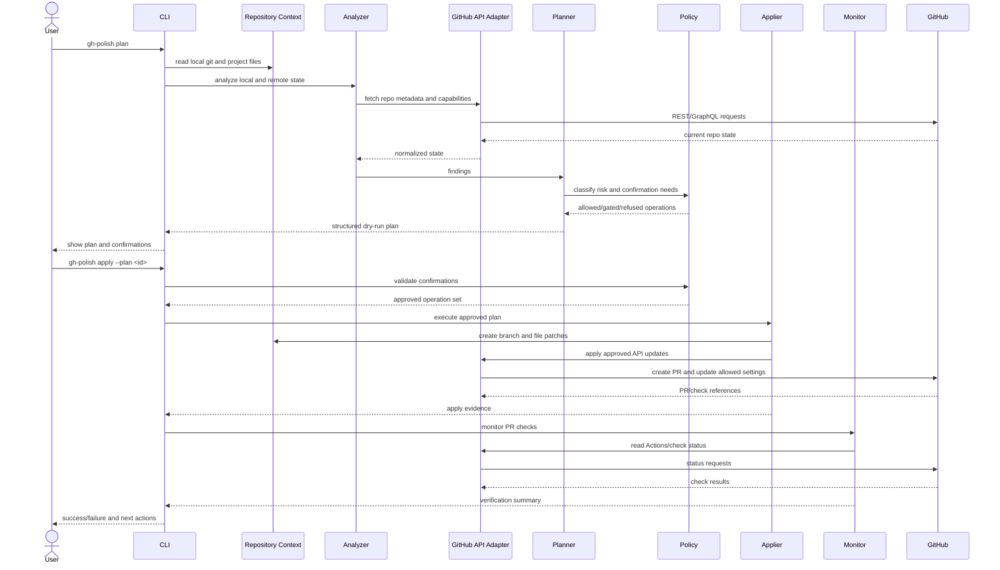
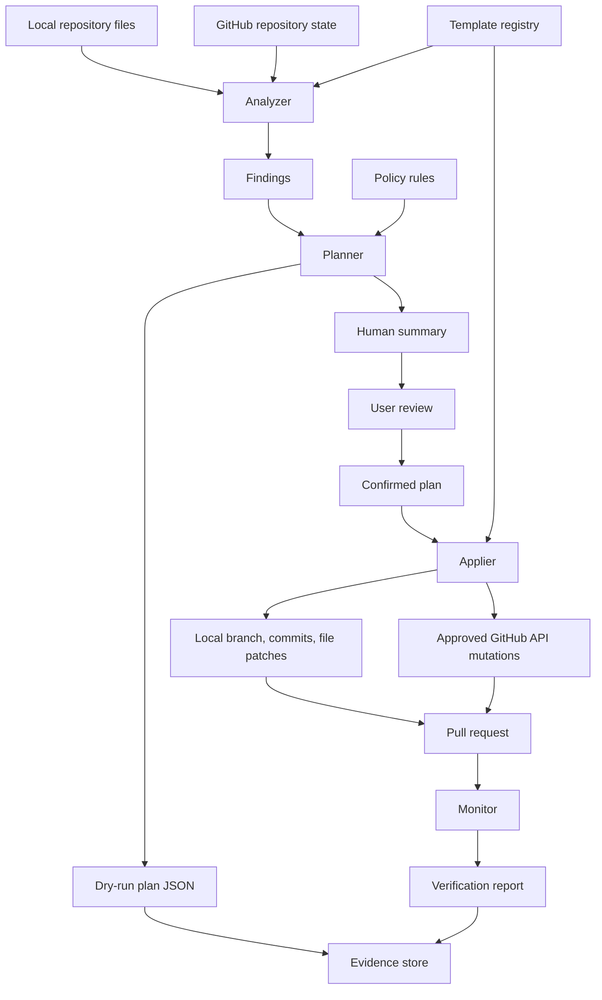
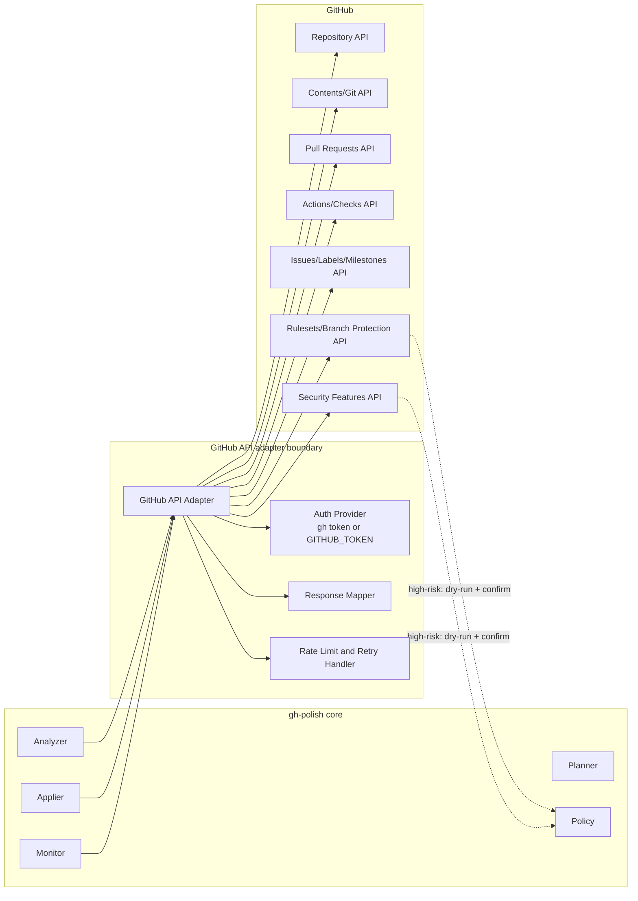

# Architecture

## Direction

gh-polish is CLI-first. The MVP runs locally, reads the current repository, authenticates through `gh auth token` or `GITHUB_TOKEN`, talks to GitHub through a dedicated adapter, creates a plan, applies approved changes through a branch and pull request, and monitors the resulting checks.

The architecture intentionally avoids a hosted service, database, queue, or Web UI until the local workflow proves useful.

## Primary Components

- CLI: command entrypoint, argument parsing, user prompts, human-readable output.
- Repository Context: local git state, remote URL, default branch, workspace paths.
- GitHub API Adapter: all GitHub REST/GraphQL/gh CLI calls behind one boundary.
- Analyzer: detects project stack, existing files, workflows, metadata, and GitHub capability state.
- Planner: converts findings into a structured plan with risk, scope, confirmation, and verification metadata.
- Policy: decides which operations are allowed, confirmation-gated, or refused.
- Template Registry: stores README, workflow, issue, PR, security, and contribution templates.
- Applier: executes approved file patches and GitHub API mutations.
- Monitor: reads Actions, checks, alerts, and pull request status after apply.
- Evidence Store: saves plans, dry-run snapshots, apply logs, and verification summaries.

## C4 Context Diagram



## Container Diagram



## Core Workflow Sequence Diagram



## Data Flow Diagram



## GitHub Integration Boundary Diagram



## Proposed Future Structure

This is illustrative only and should not be created until implementation starts.

```text
src/
  cli/
  repo/
  github/
  analyzer/
  planner/
  policy/
  applier/
  monitor/
  templates/
test/
  unit/
  integration/
  smoke/
```

## Key Boundaries

- Analyzer can read but must not mutate.
- Planner can propose but must not mutate.
- Policy is the only source of confirmation requirements.
- Applier must only execute an approved plan.
- GitHub API calls must go through the adapter.
- Monitor can read status and propose follow-up actions, but should not auto-fix failures in MVP.
