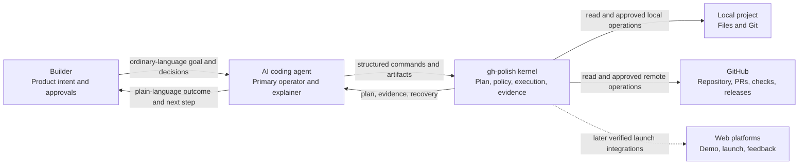
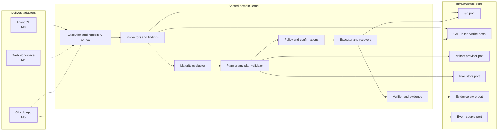
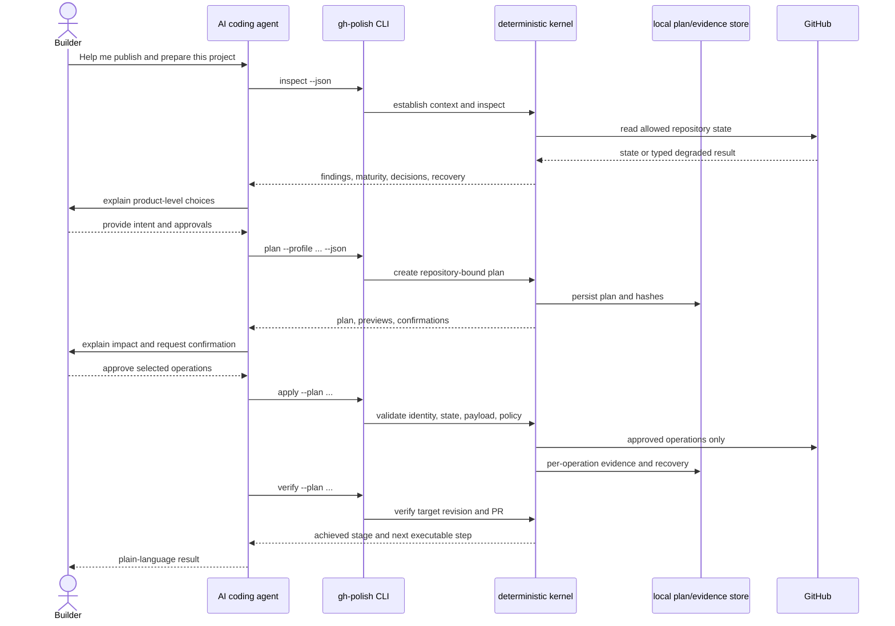
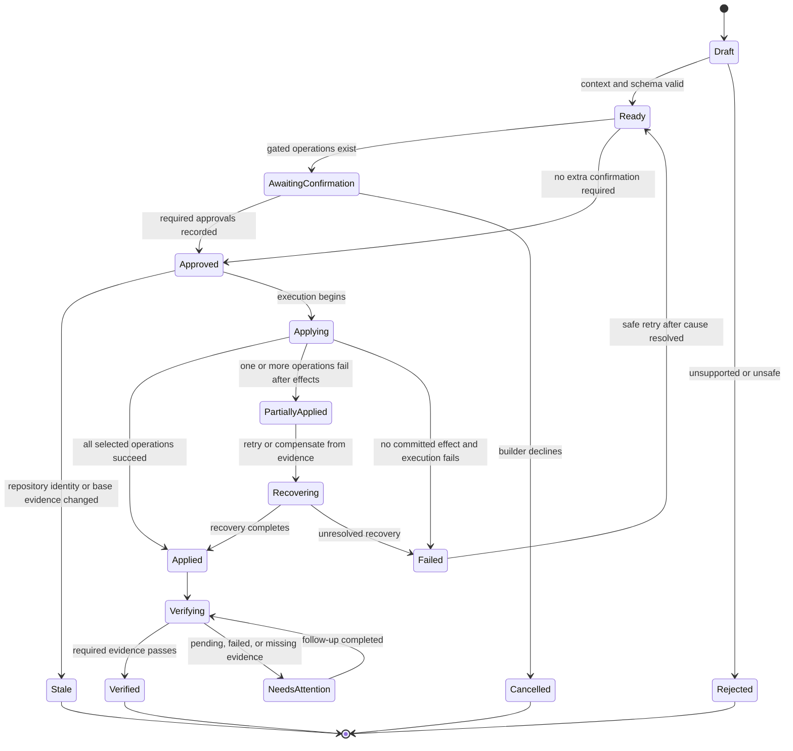

# Architecture

## Direction

gh-polish is an agent-native workflow with a deterministic execution kernel. The first adapter is a local CLI operated by an external AI coding agent. Future adapters include a human-oriented Web workspace and an installation-scoped GitHub App.

The architecture must make later delivery surfaces possible without pretending their infrastructure exists today. M0 has no hosted service, shared database, queue, billing system, or Web runtime.

## Responsibility Boundary

### External AI Coding Agent

- Understands the project and conversation.
- Asks product-level questions in ordinary language.
- Drafts contextual prose, visuals, and remediation candidates.
- Invokes gh-polish and explains structured results.
- Does not decide whether mutation is authorized or whether evidence is sufficient.

### Deterministic gh-polish Kernel

- Establishes repository and authentication context.
- Normalizes inspection evidence.
- Creates and validates versioned plans.
- Applies policy, staleness, confirmation, and scope gates.
- Executes approved operations through adapters.
- Records per-operation evidence, recovery, and lifecycle state.
- Never invents a successful check, deployment, or product claim.

## Context Diagram

## Logical Components

- **Interaction Adapter:** CLI now; Web API and GitHub App event adapters later.
- **Execution Context:** actor, repository identity, auth capability, environment, invocation source, and correlation identifiers.
- **Repository Context:** local Git state, remotes, default branch, base revision, workspace paths, and dirty state.
- **Inspectors:** local, GitHub, deployment, presentation, launch, and later growth signal providers.
- **Finding Model:** normalized evidence, provenance, confidence, degraded states, and recovery instructions.
- **Maturity Evaluator:** evidence-backed stage and unmet outcomes; not a single opaque score.
- **Planner:** converts findings and builder intent into an identity-bound plan.
- **Policy:** decides allowed, confirmation-gated, recommendation-only, or refused operations.
- **Artifact Registry:** README, workflows, community files, screenshots, demo evidence, releases, launch assets, and future content types.
- **Executor:** applies only validated operations through local and remote ports.
- **Verifier:** binds evidence to the target plan, revision, pull request, deployment, or release.
- **Plan Store / Evidence Store Ports:** local files in M0; hosted implementations only when later stages are contracted.

## Ports and Adapters

Dashed paths are planned adapters, not current runtime dependencies.

## M0 Workflow

## Plan and Execution State Machine

## Durable Domain Records

### Plan

- schema and tool version;
- repository identity and host;
- base branch, revision, and relevant file hashes;
- profile, builder intent, assumptions, and expiry policy;
- immutable operation payloads and digests;
- risk, confirmation, verification, recovery, and expected evidence;
- lifecycle state and supersession links.

### Evidence

- operation identifier and before/after references;
- target revision, pull request, check, deployment, release, or artifact;
- observed result, timestamp, provenance, and confidence;
- partial failure, retry, compensation, and next action;
- no secrets or unnecessarily retained repository content.

### Artifact

- type, target, source, generator, preview, and content digest;
- evidence backing factual claims;
- create, patch, replace, publish, or manual-review semantics;
- builder approval when publication or replacement is consequential.

## Delivery-Surface Evolution

| Stage | Runtime | State | Trigger | Primary experience |
|---|---|---|---|---|
| M0-M3 | Local CLI invoked by coding agent | Local plan/evidence files | Explicit agent command | Conversational through coding agent |
| M4 | Web workspace plus shared kernel service | Hosted per-user/project state | User session and explicit action | Visual decisions, previews, plans, evidence |
| M5 | GitHub App workers plus shared kernel | Installation-scoped durable state | Webhook, schedule, user approval | GitHub checks/comments plus Web control |
| M6 | Multi-project services and integrations | Tenant-aware portfolio and campaign state | Events, schedules, explicit publication | Portfolio, growth, and team workflows |

The table is an architecture runway, not a vendor or implementation commitment.

## Maturity Responsibilities

- **M0 Agent-Native Deterministic Kernel:** repository identity, plans, policy, dry-run execution, verification, evidence, and recovery.
- **M1 Repository Ready:** contextual repository presentation and runnable project entry points.
- **M2 Trust Ready:** explicit legal, support, security, CI, dependency, permission, and maintenance evidence.
- **M3 Demo and Launch Ready:** verified runtime/demo, truthful visuals, release, launch assets, and feedback path.
- **M4 Web Workspace:** human control plane over the shared kernel, plans, previews, decisions, and evidence.
- **M5 GitHub App Continuous Stewardship:** least-privilege event/schedule adapters over the same plan and policy model.
- **M6 Growth, Portfolio, and Team:** consent-based distribution, feedback, multi-project state, roles, and organization policy.

## Mutation Boundaries

- Local file and branch changes, immediate GitHub metadata changes, merge/release actions, and external publication are separate operation groups.
- A success in one group must not hide failure in another.
- Immediate remote mutations must not be presented as reviewable PR contents.
- Hosted execution must use least-privilege, short-lived installation or user authorization and preserve plan identity.
- Webhooks and schedules may propose work; they do not grant implicit approval for high-impact mutation.

## Reuse Boundaries

- Prefer GitHub CLI and official APIs behind ports for authentication, pull requests, checks, and repository operations.
- Prefer official workflow/community sources and mature inspectors over a proprietary checklist engine.
- Use AI coding agents for project-specific creation; keep authorization and evidence deterministic.
- Add an abstraction only when it supports an existing or explicitly planned delivery surface.

## Current Implementation Mapping

Existing modules approximate several logical components, but they are prototypes rather than the completed architecture:

- `repositoryContext.ts` and `git.ts`: partial Repository Context and Git port.
- `githubAdapter.ts`: partial read-only GitHub port.
- `localAnalyzer.ts` and `remoteAnalyzer.ts`: initial inspectors.
- `policy.ts`: initial policy decisions.
- `planner.ts`: non-versioned plan prototype.
- `templateRegistry.ts`: initial artifact provider prototype.
- `applier.ts`: injected executor interfaces without durable plan loading or production clients.
- `monitor.ts`: repository-wide workflow summary, not plan-bound verification.
- `cli.ts`: command stub, not integrated delivery adapter.

T-014 begins closing the gap with a trusted local CLI thin slice and a durable plan contract. It must not pretend M1-M5 capabilities or adapters are already implemented.
