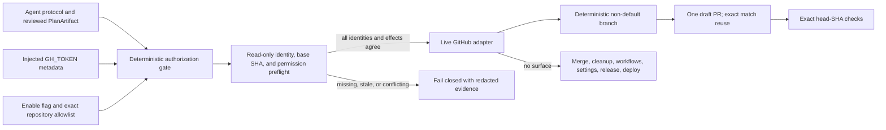

# Blueprints

Lifecycle status values:

- `planned`: required for a contracted later stage but not yet implementation-guiding;
- `current`: accurate enough to guide the current stage;
- `stale`: exists but no longer reflects the system;
- `missing`: required for current work and absent;
- `not-applicable`: deliberately unnecessary across the planned product path.

## Blueprint Index

| ID | Diagram | Status | Path / URL | Owner | Updated | Notes |
|---|---|---|---|---|---|---|
| UJM | Builder Journey and Jobs | current | docs/PRD.md | project | 2026-07-11 | Covers novice builder, coding agent, kernel, launch, and stewardship outcomes. |
| UF | M0 Agent Workflow | current | docs/PRD.md, docs/ARCHITECTURE.md | project | 2026-07-11 | Covers inspect, decisions, plan, apply, verify, and next action. |
| MM | Product Maturity Model | current | docs/NORTH_STAR.md, docs/MVP_TASKS.md | project | 2026-07-11 | M0 kernel through M6 growth/portfolio/team stages, with Trust Ready explicit. |
| PF | Web Workspace Page Flow | planned | future M4 contract | project | | Must be created before Web UI implementation. |
| SA | System Architecture | current | docs/ARCHITECTURE.md | project | 2026-07-11 | Agent/kernel boundary and delivery-surface evolution are explicit. |
| CD | Ports and Adapters | current | docs/ARCHITECTURE.md | project | 2026-07-11 | CLI current; Web and App adapters planned without infrastructure claims. |
| SEQ | M0 Core Sequence | current | docs/ARCHITECTURE.md | project | 2026-07-11 | Builder-agent-kernel-plan-evidence workflow. |
| SM | Plan and Execution State Machine | current | docs/ARCHITECTURE.md | project | 2026-07-11 | Includes staleness, partial application, recovery, and verification. |
| DFD | Plan, Artifact, and Evidence Flow | current | docs/ARCHITECTURE.md | project | 2026-07-11 | Expressed through logical components, sequence, and durable records. |
| DM | Hosted Data and Tenancy Model | planned | future M4 contract | project | | Required before hosted persistence selection. |
| DEP | Deployment Topology | planned | future M4/M5 contract | project | | CLI is local; hosted and App topology intentionally vendor-neutral. |
| APP | GitHub App Event and Permission Flow | planned | future M5 contract | project | | Required before App registration or webhook implementation. |
| CICD | Product CI/CD Pipeline | planned | docs/HARNESS_SPEC.md | project | | Current npm gates exist; release/deployment flow is not contracted. |
| SEC | Threat and Trust Boundary Model | current | docs/BLUEPRINTS.md, docs/CONTRACTS.md, CD-010 | project | 2026-07-11 | Guides T-022 non-live implementation; live mutation still requires independent runtime gates and exact effect confirmation. |

## Stage Rules

- M0 work must keep SA, CD, SEQ, SM, and DFD current.
- M4 cannot begin until PF, DM, DEP, and a threat model are current.
- M5 cannot begin until APP, SEC, installation lifecycle, retry/deduplication, and data-retention blueprints are current.
- A planned blueprint is a roadmap commitment, not evidence that the architecture has been implemented.

## SEC Live GitHub Trust Boundary

Trust rules:

- Tokens remain in memory and are replaced by redacted credential metadata before evidence, errors, traces, or persistence.
- Authorization requires the global enable flag, exact `HaipingShi/coderail` allowlist, fetched numeric repository identity, artifact/local-remote/base agreement, valid review token, and exact confirmed effects.
- The adapter exposes only deterministic branch, draft-PR, and exact-SHA check operations. It has no merge, cleanup, workflow, settings, release, or deployment operation.
- T-022 mandatory verification injects HTTP/Git doubles and never consumes ambient credentials or contacts GitHub. Live execution is a later explicit gate.
