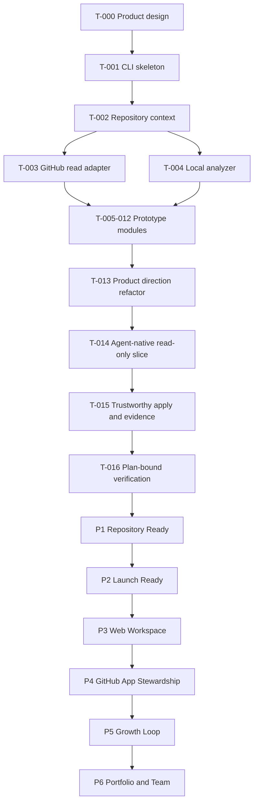

# Task Graph

The graph connects the completed prototype batch to the next executable foundation tasks and the planned product maturity stages.

## Current Critical Path

`T-013 -> T-014 -> T-015 -> T-016 -> P1`

Web UI, GitHub App, growth, and portfolio work remain planned product stages. They are not parallel implementation tracks until the preceding stage gate has evidence.
